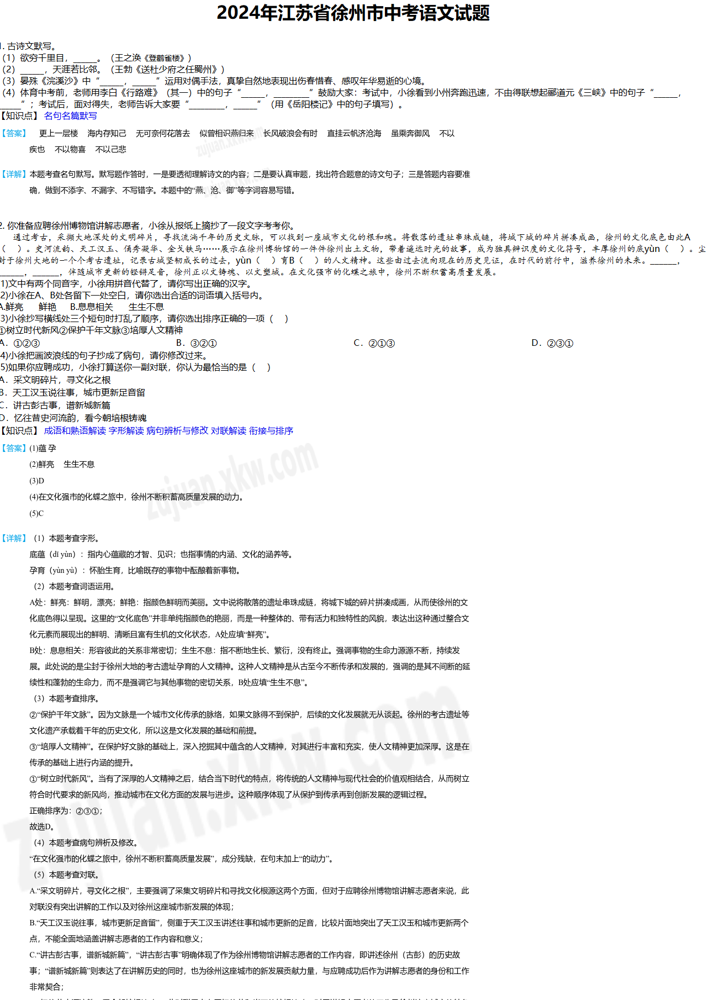

# Tampermonkey-image-copy

Tampermonkey script to copy images from web page

## Why would one want this ?

I first made this to use in parallel with [组卷网试卷处理下载打印](https://github.com/bzyzh/xkw-zujuan-script), which has problems downloading answers. It turns pages of 组卷网 to something like this :

I try to build from here and adds the answers, which are images, to the clipboard to be paste later to a document.